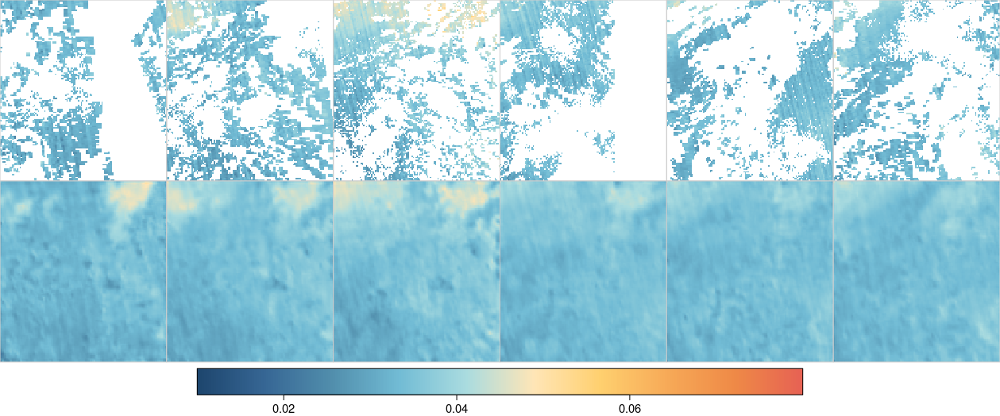

# Data-driven gap filling of satellite image time series using neural networks with spatiotemporal partial convolutions

This repository implements three-dimensional partial convolutions for filling gaps in satellite image time series.  The repository includes

- Code for three-dimensional partial convolututional layers (extending `tensorflow.keras.layers.Conv3D`)
- Code for a U-Net-like model to fill gaps of spatiotemporal blocks
- A small test dataset based on Sentinel-5P total column carbon monoxide measurements
- An example model to fill gaps in the test dataset


The method is based on the following paper on two-dimensional image inpainting:

> Liu, G., Reda, F. A., Shih, K. J., Wang, T. C., Tao, A., & Catanzaro, B. (2018). Image inpainting for irregular holes using partial convolutions. In Proceedings of the European conference on computer vision (ECCV) (pp. 85-100).  

The code is based on the existing [Keras implementation](https://github.com/MathiasGruber/PConv-Keras) of two-dimensional partial convolutions copyright (c) 2018 Mathias Gruber, licensed under the terms of the [MIT license](https://github.com/MathiasGruber/PConv-Keras/blob/master/LICENSE).


## Dependencies

- Python 3
- TensorFlow >= 2.5.0
- RasterIO
- NumPy
- scikit-image


## Example

The figure below shows input (top row) and correspodning predictions (bottom row) of the provided example model, applied on a small spatiotemporal block of Sentinel-5P total column carbon monoxide measurements.




## Getting started

If all dependcies are available, you can directly run one of the provided scripts to train a model on provided test data (`01_train.py`) or to fill gaps to fill gaps in provided test data using the pre-trained model (`02_predict.py`). 


<!-- ### Model Training
TODO -->


<!-- ### Predictions
TODO -->

### Docker

In case you have trouble with dependencies and or version conflicts of packages, you can build the provided Docker image, which gives you a JupyterLab environment with pre-installed dependencies:

```
sudo docker build -t appelmar/stpconv .
sudo docker run -it --rm -p 8888:8888 -e JUPYTER_ENABLE_LAB=yes -v ${PWD}:/home/jovyan/work appelmar/stpconv  
```

This should give a link to access JupyterLab in your browser und run the provided scripts.

 


## Data Format and Naming Conventions

Input and output data blocks are stored as GeoTIFF files, where bands represent time. Notice the following file naming conventions: GeoTIFF files starting with X represent input measurements for training, where artificial gaps have been added. Files starting with Y represent true measurements without artificially added gaps (but still containing gaps in many cases). Binary masks of input data where all pixels with valid measurements are 1 and others 0 are stored in files whose name starts with MASK, while files starting with VALMASK contain a binary mask where only pixels that are available in Y but not in X are 1. The latter is used for validation on artificially removed pixels only. Numbers in filenames encode spatial and temporal block indexes. 
